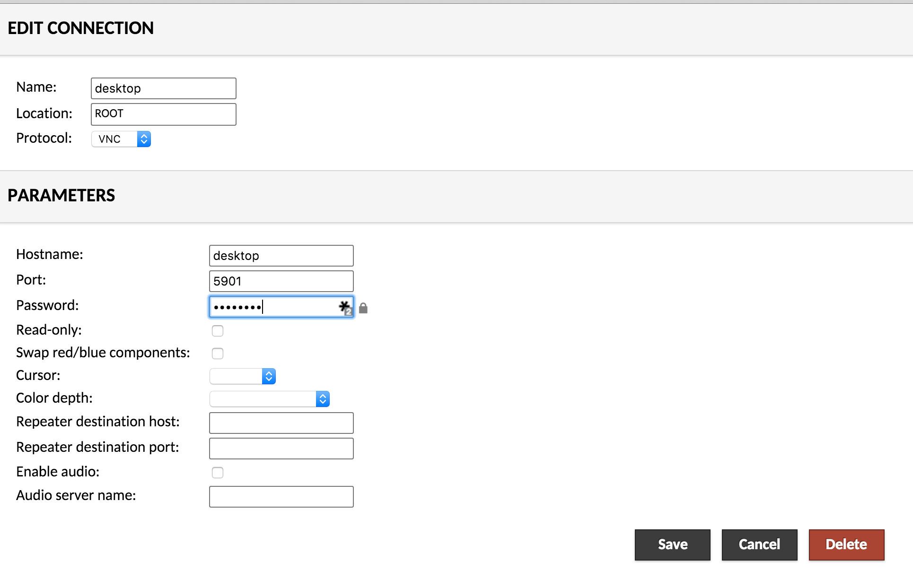
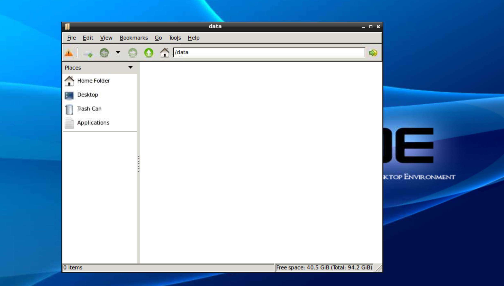

# docker-compose for Guacamole


Run [Guacamole](http://guac-dev.org/), the clientless remote desktop gateway inside Docker containers:
```
 $ docker-compose up
```
And point your browser at [http://localhost:8080](http://localhost:8080).
The default user is `guacadmin` with password `guacadmin`.

Add the desktop image as a new connection and use `password` as the password:


And connect to with a browser to the specified host:port as defined in docker-compose: server: ports:


