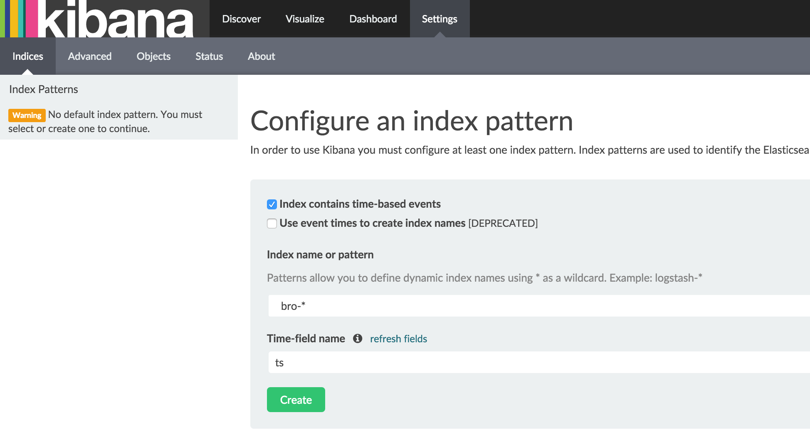
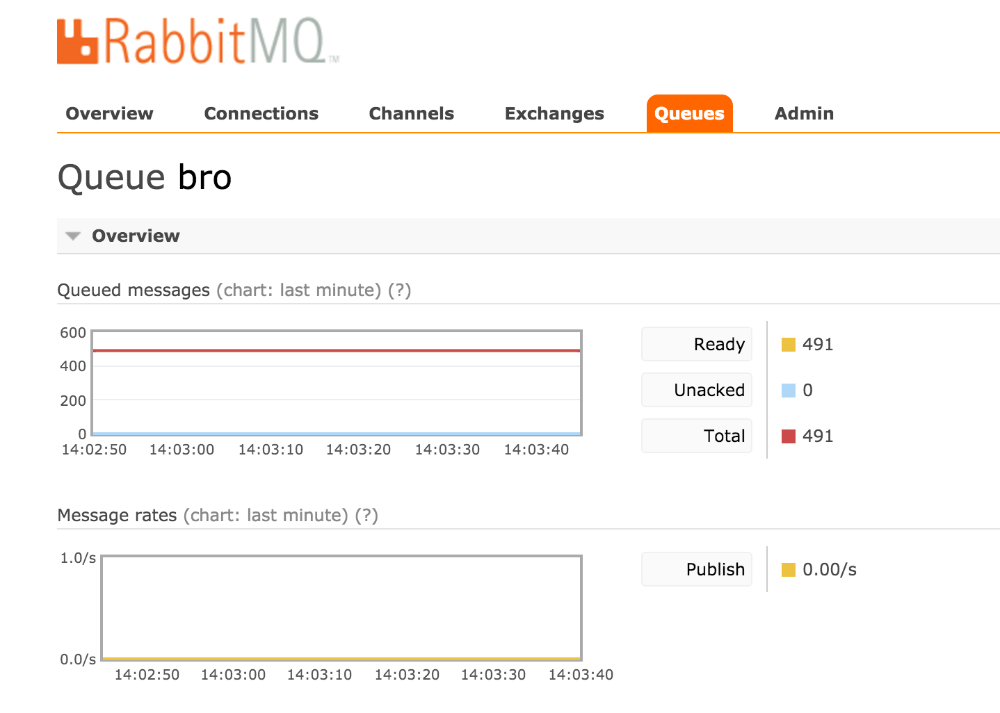
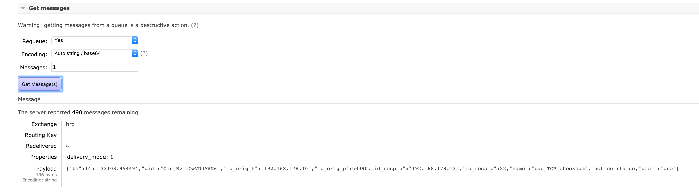

# Bro + Elastisearch + RabbitMQ

```
docker-compose up
```

# Bro via xinitd
To stream a pcap:
```
sudo tcpdump -i eth0 -s 0 -w /dev/stdout | nc localhost 1969
```
See results at [http://localhost:5601/](http://localhost:5601/)

Set filter


# Bro via RabbitMQ
```
sudo tcpdump -i eth0 -s 0 -w /dev/stdout | nc localhost 1970
```
See results in RabbitMQ [http://localhost:15672/](http://localhost:15672/)



